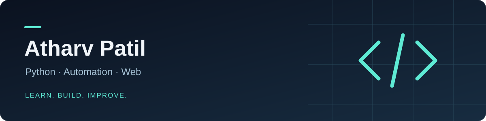

## Hi, I'm Atharv

I'm a **vibe coder** — I turn ideas into small projects with AI assistance, open-source tools and hands-on experimentation. I'm not a traditional developer; I learn by trying things, asking questions and refining what works. My interests include **Telegram bots**, **automation** and **personal websites**.

### What I'm working on

- **Bots & automation** — exploring ways to simplify repetitive tasks.
- **Web development** — building and customising personal web experiences.
- **Better project foundations** — clearer documentation, configuration and maintainability.

### Tools & technologies I explore

`Python` · `HTML` · `CSS` · `JavaScript` · `Git` · `GitHub` · `Linux`

### Around this GitHub

You'll find personal experiments, learning projects and forks of tools I explore. Forks and template-based projects are credited to their original authors; they aren't presented as original products.

- **[ProfileSite](https://github.com/atharvtg2252/ProfileSite)** — a personal portfolio project built from an open-source theme.
- **[Public repositories](https://github.com/atharvtg2252?tab=repositories)** — browse the rest of my work and experiments.

---

**Ideas first. AI-assisted building. Learning as I go.**
